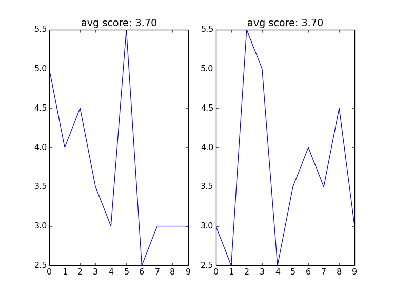

abcd
====

考研英语, 完型 20 题 10 分. 大多数人(英语分低于 55), 做 20-30 分钟得 3 分左右.
25% 的概率蒙对, 全蒙也能得 2.5.

观察 [10 年考研英语真题答案](https://github.com/JackonYang/abcd/blob/master/data/data.txt)
的分布率, 虽然整体处于等概率分布, 但规律性依旧非常强:

1. 完型第 1 题, D - 0 次, C - 2 次. 其中 1 次 C 在最早的 2005 年
2. 完型第 20 题,  A - 1 次 B - 2 次. 其中 1 次 B 也在遥远的 2005 年

与其提高做题能力, 不如研究下如何蒙.

- 菜鸟可以用更少的时间穩拿 3-4 分
- 高手(得分 6-7 分)结合做出来的题, 有技巧的蒙其他题, 应该可以提高 1-2 分.

另外, 政治的多项选择, 是不是也可以套用这套分析方法提高下得分率?

代码用法
--------

依赖 python 库:

- matplotlib

运行:

```shell
$ python trick.py
```

#### 近 10 年完型填空各题频率最高选项与次数

第 1 题 `4, A/B` 表示 A, B 选项出现概率最高, 各 4 次. 即 C, D 共出现 2 次.

题号 | 次数 | 选项
---- | ---- | ----
1 | 4 | A/B
2 | 4 | B/D
3 | 3 | A/D
4 | 4 | C
5 | 5 | C
6 | 4 | A/B
7 | 4 | D
8 | 3 | A/D
9 | 3 | B/D
10 | 3 | A/C
11 | 3 | C/D
12 | 3 | A/C
13 | 3 | A/D
14 | 5 | C
15 | 4 | B
16 | 3 | C/D
17 | 3 | A/C
18 | 5 | C
19 | 4 | A/B
20 | 4 | D

取如下 2 组选项作为答案, 与历年标准答案比较, 得分情况如图:
```shell
A, B, A, C, C, A, D, A, B, A, C, A, A, C, B, C, A, C, A, D
B, D, D, C, C, B, D, D, D, C, D, C, D, C, B, D, C, C, B, D
```




英语
----

#### 历年答案

年份 | 完型 | 阅读 A | 阅读 B
---- | ---- | ------ | ------
2005 | CBACBADADBCADCDBCDAB | CBACBCDADBACDDABDABC | ECGFB
2006 | ABDADCBCAACBDCCABCAD | CACDBABCDDCACDBDBDBA | CABFD
2007 | BDACCDBABCADACBDCABD | CBADCDCAABCBDCBDABAD | FDBCE
2008 | BDACCABDBCBDACDDCABA | ADCBDDCAABACBDCDBCAB | DGACE
2009 | BADBCADCBDDBCDACBAAC | CDADAACDABDBBCCBBDAC | CEABG
2010 | ABCBCBDACDCAADBADCBD | BCDAADDCBABDACCADCBA | BFDGA
2011 | CDBBABADCABCDCBDADAC | CBDBABDCACDCBAACDADB | BDACF
2012 | BABDCBDBABACCDACACDD | DBACDCDADAABBDDCDBCA | CDAFG
2013 | ADCABBADDADCBDBCACBC | BDADCBDCADBADCCCCDAD | EFBGC
2014 | ABDCAACBDCDABADBDCCB | BCDADDCBACDBBAAACCDB | CFGDB


#### 总体分布率

ABCD 总体分布率, 基本是等概率分布

1. D 概率相对高了一丢丢

    - 06 年, 没有等概率分布, D 在阅读题中的概率高了一丢丢.
    - 12, 13 年, 没有等概率分布, D 在阅读中的概率高了 2 丢丢.

2. 具体到每一题, 在选项的分布上, 倾向性非常强.

    一般有 2 个选项出现概率非常高, 另外 2 个选项十年出现不足 3 次. 甚至, 个别选项从未出现过.
    

```shell
------------------------- 每年 ABCD 比例分布 -------------------------
2005 total:  [10, 10, 10, 10]   cloze:  [5, 5, 5, 5]    read_a:  [5, 5, 5, 5]
2006 total:  [10, 9, 11, 10]    cloze:  [6, 4, 6, 4]    read_a:  [4, 5, 5, 6]
2007 total:  [10, 10, 10, 10]   cloze:  [5, 5, 5, 5]    read_a:  [5, 5, 5, 5]
2008 total:  [10, 10, 10, 10]   cloze:  [5, 5, 5, 5]    read_a:  [5, 5, 5, 5]
2009 total:  [10, 10, 10, 10]   cloze:  [5, 5, 5, 5]    read_a:  [5, 5, 5, 5]
2010 total:  [11, 9, 10, 10]    cloze:  [5, 5, 5, 5]    read_a:  [6, 4, 5, 5]
2011 total:  [10, 10, 10, 10]   cloze:  [5, 5, 5, 5]    read_a:  [5, 5, 5, 5]
2012 total:  [10, 9, 9, 12]     cloze:  [5, 5, 5, 5]    read_a:  [5, 4, 4, 7]
2013 total:  [9, 8, 11, 12]     cloze:  [5, 5, 5, 5]    read_a:  [4, 3, 6, 7]
2014 total:  [10, 10, 10, 10]   cloze:  [5, 5, 5, 5]    read_a:  [5, 5, 5, 5]
--------------------------- 45 个选择题各选项出现次数统计 ---------------------------
A [4, 2, 3, 2, 2, 4, 2, 3, 2, 3, 2, 3, 3, 1, 2, 2, 3, 3, 4, 1, 1, 1, 5, 2, 3, 2, 0, 4, 6, 2, 3, 2, 1, 2, 3, 2, 1, 2, 4, 3, 0, 1, 4, 0, 1]
B [4, 4, 2, 3, 2, 4, 3, 2, 3, 2, 2, 2, 2, 0, 4, 2, 2, 0, 4, 2, 3, 4, 0, 2, 2, 2, 1, 1, 1, 4, 2, 4, 5, 0, 2, 2, 3, 2, 3, 3, 2, 0, 3, 1, 2]
C [2, 0, 2, 4, 5, 1, 1, 2, 2, 3, 3, 3, 2, 5, 1, 3, 3, 5, 1, 3, 5, 2, 2, 2, 2, 2, 4, 4, 0, 2, 2, 3, 1, 4, 4, 3, 2, 3, 1, 2, 4, 1, 0, 3, 1]
D [0, 4, 3, 1, 1, 1, 4, 3, 3, 2, 3, 2, 3, 4, 3, 3, 2, 2, 1, 4, 1, 3, 3, 4, 3, 4, 5, 1, 3, 2, 3, 1, 3, 4, 1, 3, 4, 3, 2, 2, 1, 3, 1, 1, 1]
E [0, 0, 0, 0, 0, 0, 0, 0, 0, 0, 0, 0, 0, 0, 0, 0, 0, 0, 0, 0, 0, 0, 0, 0, 0, 0, 0, 0, 0, 0, 0, 0, 0, 0, 0, 0, 0, 0, 0, 0, 2, 1, 0, 0, 2]
F [0, 0, 0, 0, 0, 0, 0, 0, 0, 0, 0, 0, 0, 0, 0, 0, 0, 0, 0, 0, 0, 0, 0, 0, 0, 0, 0, 0, 0, 0, 0, 0, 0, 0, 0, 0, 0, 0, 0, 0, 1, 3, 0, 3, 1]
G [0, 0, 0, 0, 0, 0, 0, 0, 0, 0, 0, 0, 0, 0, 0, 0, 0, 0, 0, 0, 0, 0, 0, 0, 0, 0, 0, 0, 0, 0, 0, 0, 0, 0, 0, 0, 0, 0, 0, 0, 0, 1, 2, 2, 2]
```
