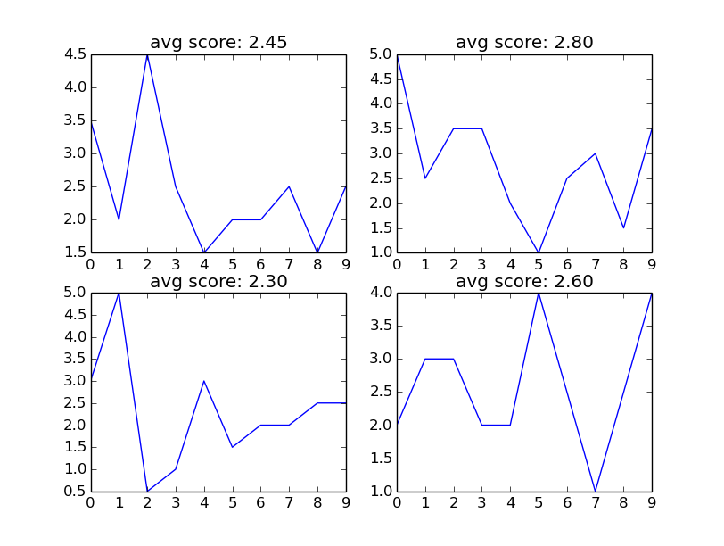

abcd
====

考研英语, 完型 20 题 10 分. 大多数人(英语分低于 55), 做 20-30 分钟得 3 分左右.
25% 的概率蒙对, 全蒙也能得 2.5.

观察 [10 年考研英语真题答案](https://github.com/JackonYang/abcd/blob/master/data/data.txt)
的分布率, 虽然整体处于等概率分布, 但规律性依旧非常强:

1. 完型第 1 题, D - 0 次, C - 2 次. 其中 1 次 C 在最早的 2005 年
2. 完型第 20 题,  A - 1 次 B - 2 次. 其中 1 次 B 也在遥远的 2005 年

与其提高做题能力, 不如研究下如何蒙.

- 菜鸟可以用更少的时间穩拿 3-4 分
- 高手(得分 6-7 分)结合做出来的题, 有技巧的蒙其他题, 应该可以提高 1-2 分.

另外, 政治的多项选择, 是不是也可以套用这套分析方法提高下得分率?

代码用法
--------

依赖 python 库:

- matplotlib

运行:

```shell
$ python trick.py
```

英语完型分析
------------

#### 历年答案

年份 | 完型 | 阅读 A | 阅读 B
---- | ---- | ------ | ------
2005 | CBACBADADBCADCDBCDAB | CBACBCDADBACDDABDABC | ECGFB
2006 | ABDADCBCAACBDCCABCAD | CACDBABCDDCACDBDBDBA | CABFD
2007 | BDACCDBABCADACBDCABD | CBADCDCAABCBDCBDABAD | FDBCE
2008 | BDACCABDBCBDACDDCABA | ADCBDDCAABACBDCDBCAB | DGACE
2009 | BADBCADCBDDBCDACBAAC | CDADAACDABDBBCCBBDAC | CEABG
2010 | ABCBCBDACDCAADBADCBD | BCDAADDCBABDACCADCBA | BFDGA
2011 | CDBBABADCABCDCBDADAC | CBDBABDCACDCBAACDADB | BDACF
2012 | BABDCBDBABACCDACACDD | DBACDCDADAABBDDCDBCA | CDAFG
2013 | ADCABBADDADCBDBCACBC | BDADCBDCADBADCCCCDAD | EFBGC
2014 | ABDCAACBDCDABADBDCCB | BCDADDCBACDBBAAACCDB | CFGDB

#### 历年答案 ABCD 比例分布均匀

D 概率相对高了一丢丢  
06 年, 没有等概率分布, D 在阅读题中的概率高了一丢丢.  
12, 13 年, 没有等概率分布, D 在阅读中的概率高了 2 丢丢.

year | total | Cloze | Reading A
---- | ----- | ----- | ---------
2005 | 10, 10, 10, 10 | 5, 5, 5, 5 | 5, 5, 5, 5
2006 | 10, 9, 11, 10 | 6, 4, 6, 4 | 4, 5, 5, 6
2007 | 10, 10, 10, 10 | 5, 5, 5, 5 | 5, 5, 5, 5
2008 | 10, 10, 10, 10 | 5, 5, 5, 5 | 5, 5, 5, 5
2009 | 10, 10, 10, 10 | 5, 5, 5, 5 | 5, 5, 5, 5
2010 | 11, 9, 10, 10 | 5, 5, 5, 5 | 6, 4, 5, 5
2011 | 10, 10, 10, 10 | 5, 5, 5, 5 | 5, 5, 5, 5
2012 | 10, 9, 9, 12 | 5, 5, 5, 5 | 5, 4, 4, 7
2013 | 9, 8, 11, 12 | 5, 5, 5, 5 | 4, 3, 6, 7
2014 | 10, 10, 10, 10 | 5, 5, 5, 5 | 5, 5, 5, 5

#### 完型各选项出现次数倾向性很强

每题, 一般有 1-2 个选项出现概率非常高,  
另外 2 个选项十年出现不足 3 次.  
甚至, 个别选项从未出现过.

各选项出现详细次数见下表

    |  1  |  2  |  3  |  4  |  5  |  6  |  7  |  8  |  9  |  10 |  11 |  12 |  13 |  14 |  15 |  16 |  17 |  18 |  19 |  20
--- | --- | --- | --- | --- | --- | --- | --- | --- | --- | --- | --- | --- | --- | --- | --- | --- | --- | --- | --- | --- 
A | 4 | 2 | 3 | 2 | 2 | 4 | 2 | 3 | 2 | 3 | 2 | 3 | 3 | 1 | 2 | 2 | 3 | 3 | 4 | 1
B | 4 | 4 | 2 | 3 | 2 | 4 | 3 | 2 | 3 | 2 | 2 | 2 | 2 | 0 | 4 | 2 | 2 | 0 | 4 | 2
C | 2 | 0 | 2 | 4 | 5 | 1 | 1 | 2 | 2 | 3 | 3 | 3 | 2 | 5 | 1 | 3 | 3 | 5 | 1 | 3
D | 0 | 4 | 3 | 1 | 1 | 1 | 4 | 3 | 3 | 2 | 3 | 2 | 3 | 4 | 3 | 3 | 2 | 2 | 1 | 4

#### 各题频率最高选项与次数

第 1 题 `4, A/B` 表示 A, B 选项出现概率最高, 各 4 次. 即 C, D 共出现 2 次.

题号 | 次数 | 选项
---- | ---- | ----
1 | 4 | A/B
2 | 4 | B/D
3 | 3 | A/D
4 | 4 | C
5 | 5 | C
6 | 4 | A/B
7 | 4 | D
8 | 3 | A/D
9 | 3 | B/D
10 | 3 | A/C
11 | 3 | C/D
12 | 3 | A/C
13 | 3 | A/D
14 | 5 | C
15 | 4 | B
16 | 3 | C/D
17 | 3 | A/C
18 | 5 | C
19 | 4 | A/B
20 | 4 | D

取如下 2 组选项作为答案, 与历年标准答案比较.

平均得分 3.7 左右,
最低分 2.5.
最高 5.5.

2 组答案和详细得分情况如下:

```shell
A, B, A, C, C, A, D, A, B, A, C, A, A, C, B, C, A, C, A, D
B, D, D, C, C, B, D, D, D, C, D, C, D, C, B, D, C, C, B, D
```


#### 随机答案作为衡量预测准确度的参考标准

利用随机数生生 4 组答案, 与历年标准答案比较,  
平均得分 2.5 左右,  
最低分 0.5 左右. 个别情况下出现 0 分.

4 组答案和详细得分情况如下:

```shell
D, D, A, C, A, D, B, A, A, B, A, B, D, D, B, B, D, A, D, B
C, B, A, D, C, C, C, B, D, C, A, C, D, C, D, C, C, A, A, B
A, B, B, A, B, C, A, C, B, B, B, B, C, B, C, B, B, C, A, B
A, D, D, B, A, A, C, A, D, C, C, B, A, B, B, A, A, B, C, D
```




#### 理论可达的最大得分数

n 年一组, 预测下一年, 每一年理论可达的最大分数如下:

years a group | 2014 | 2013 | 2012 | 2011 | 2010 | 2009 | 2008
------------- | ---- | ---- | ---- | ---- | ---- | ---- | ----
3 | 3.0 | 5.0 | 4.0 | 2.5 | 2.5 | 2.5 | 5.5
4 | 1.5 | 5.0 | 3.0 | 2.5 | 2.0 | 3.0 |
5 | 1.5 | 5.5 | 2.5 | 2.5 | 3.0 |     |
6 | 1.0 | 4.0 | 2.0 | 2.0 |     |     |
7 | 1.0 | 4.0 | 2.0 |     |     |     |
8 | 1.5 | 2.5 |     |     |     |     |
9 | 1.0 |     |     |     |     |     |


#### _TODO_

通过简单的对比可以发现,
利用最大频数给出的答案, 明显优于随即组合或全蒙相同选项.

所有答案序列的排列组合为 4^20, 运算量较大, 难以实现全遍历.

可以通过遗传算法找更优解.
